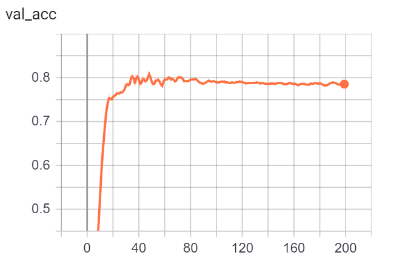
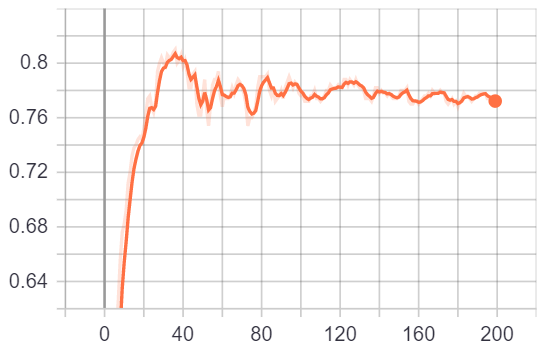
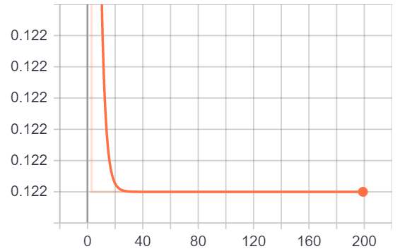
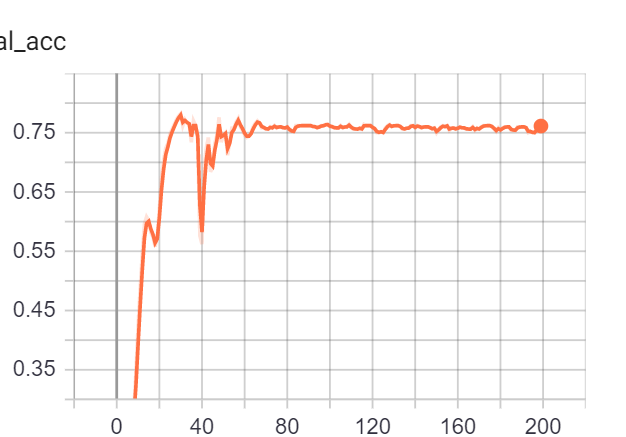
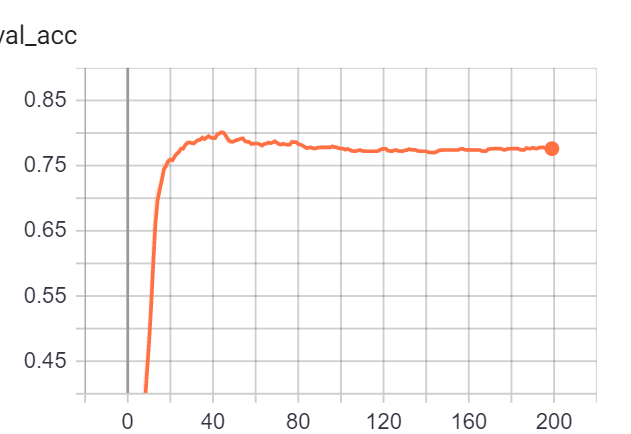

## Graph Neural Experiments

#### Experiments

1. Impact of attention
2. Impact of dropout
3. Impact of depth
4. Semi Supervised With GNN
5. Improvement over MLP

### Key Points:

"GCN": geom_nn.GCNConv -> The graph convolutional operator from the “Semi-supervised Classification with Graph Convolutional Networks” paper

"GraphConv": geom_nn.GraphConv -> The graph neural network operator from the “Weisfeiler and Leman Go Neural: Higher-order Graph Neural Networks” paper

"GAT": geom_nn.GATConv -> The graph attentional operator from the “Graph Attention Networks” paper

#### References
[1] https://arxiv.org/abs/1710.10903 -> Graph Attention Paper

[2] https://arxiv.org/abs/1609.02907 -> Semi Supervised with GNN

[3] https://arxiv.org/abs/1810.02244 -> Higher-order Graph Neural Networks

[4] https://uvadlc-notebooks.readthedocs.io/en/latest/tutorial_notebooks/tutorial7/GNN_overview.html

### Summary Results

#### 1. Operator Comparasion:








Based on the experiments on the cora dataset, GCN operator gave the best resul when 1 hidden layer was present. On introduction of multiple hidden layers, the performance of GAT and GCN operators were similar. GraphConv operator gave the worst result for all the scenarios. The topmost is the validation accuracy of GCN, then GAT and then Gconv.

#### 2. Impact of Depth:








For both GCN and GAT, adding an additional hidden layer improved the efficiency of the model. However up further increasing the depth, no significant improvements were noted. 
GraphConv gave the worst result and increasing depth negatively affected the results. In images we see the validation accuracy for number of hidden layers = 3 ,4 ,5 (Top to bottom respectively). Fluctuations in the accuracy seem to decrease as depth is increased but there is no actual increase in the accuracy. 

#### 3. Impact of dropout

As models were showing signs of overfitting, I decided to change the depth of the dropout. For GCN no significant improvements were observed. For GCN no significant improvements were observed. The improvement observed was from 0.810 to 0.815

#### 4. Improvements over MLP
 
Massive improvements from .59 for MLP to .81 for GCN were observed

### Next:

Prepare codes for further complicated models


```python

```
